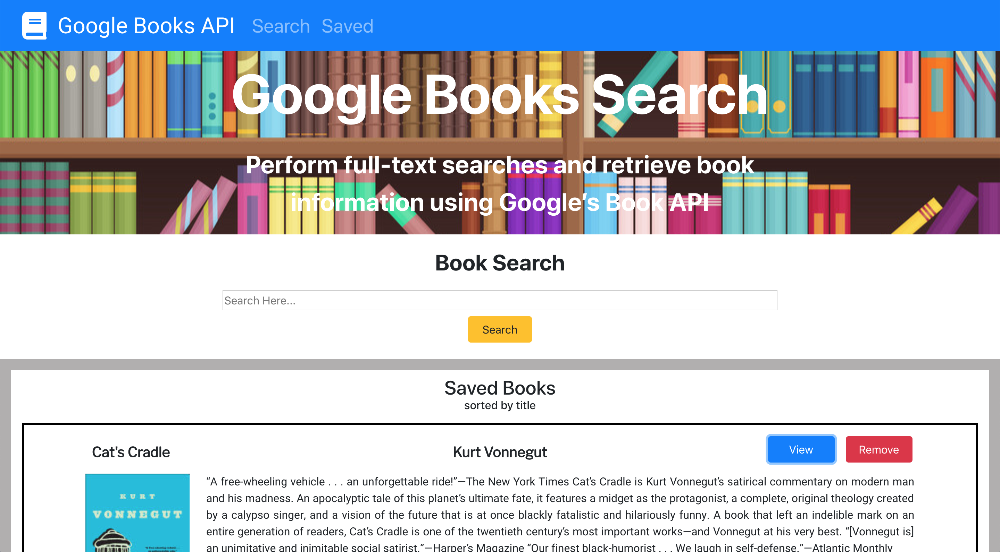

# Google Books Search API- MERN Stack

## Full-stack (MERN) application that gives the user access to Google's Books API and the ability to save a book for future reference.

### About the Application:

This application was built was Express and Node on the back-end and React on the front-end. Book data is stored using MongoDB Atlas.

### Application Instructions:

Enter a book related search term (i.e. book title or author) in the search field. Google's Books API will return a list of books based on your search. You can view additional information about the book at Google Books site and the ability to save the book to reference later.

### Software/libraries used for this application:

Node.js - used for developing the server-side of the application  
Express.js - used for building the web application and handle HTTP requests  
MongoDB Atlas- fully automated cloud platform for storing and managing the application’s data  
JavaScript - for the applications logic  
Bootstrap - front-end framework used to create modern websites and making the application responsive

### Heroku Deployment:

The application is deployed using the Heroku cloud platform. You can visit the site at:  
[https://fcarlone-book-search.herokuapp.com/](https://fcarlone-book-search.herokuapp.com/)

### Video Demo:

